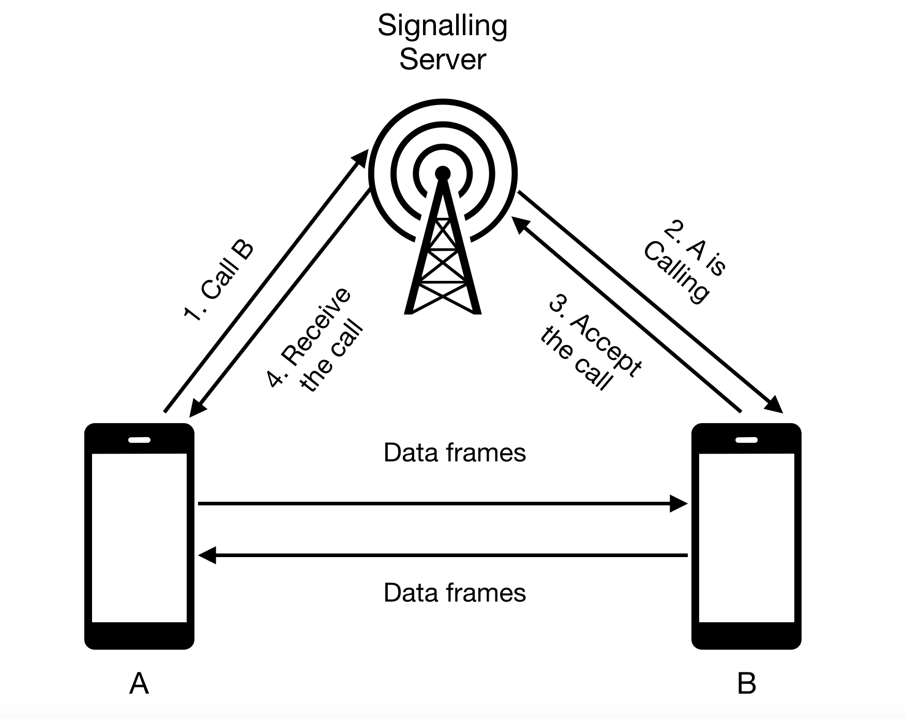
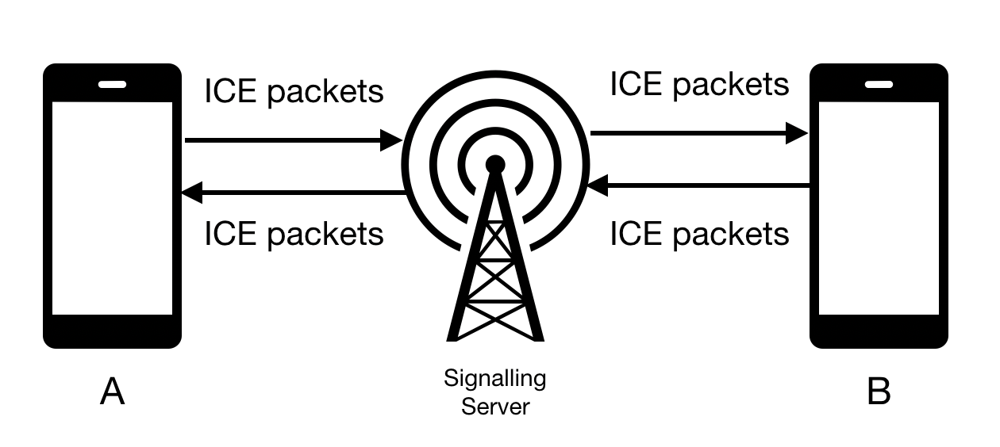

# WebRTC for Android

This repo serves as a how-to guide for implementing basic video conferencing with WebRTC. It includes:

- An Android mobile app
- A bare-bones signalling server based on WebSocket built with Ktor.

It's based on official WebRTC native library version **`1.0.27771`**

---
## What is WebRTC

The [official](https://webrtc.org/) description 

"WebRTC is a free, open project that provides browsers and mobile applications with Real-Time Communications (RTC) capabilities via simple APIs. The WebRTC components have been optimised to best serve this purpose."


Simply, it's a cross-platform API that allows developers to implement peer-to-peer real-time communication. 

Imagine an API that allows you to send voice, video and/or data (text, images...etc) across mobile apps and web apps. 

---
## How does it work (The simple version)

You have a signalling server that coordinates the initiation of the communication. Once the peer-to-peer connection is established, the signalling server is out of the equation.



(A) prepares what's called SDP - [Session Description Protocol](https://developer.mozilla.org/en-US/docs/Web/API/WebRTC_API/Protocols#SDP) - which we will call "offer". 

(A) sends this offer to the signalling server to request to be connected to (B).

The signalling server then sends this "offer" to (B).

(B) receives the offer and it will create an SDP of its own and send it back to the signalling server. We will call it "answer". 

The signalling server then send this "answer" to (A).

A peer-to-peer connection is then created to exchange data.

It's not magic. Something really important is happening is the background, both (A) &amp; (B) are also exchanging public IP addresses. This is done through ICE - [Interactive Connectivity Establishment](https://developer.mozilla.org/en-US/docs/Web/API/WebRTC_API/Protocols#ICE) - which uses a 3rd party server to fetch the public IP address. Those servers are known as [STUN](https://developer.mozilla.org/en-US/docs/Web/API/WebRTC_API/Protocols#STUN) or [TURN](https://developer.mozilla.org/en-US/docs/Web/API/WebRTC_API/Protocols#TURN).



(A) starts sending "ICE packets" from the moment it creates the "offer". Similarly, (B) starts sending the "answer".

---

## Getting a local video stream

*Branch [step/local-video](https://github.com/amrfarid140/webrtc-android-codelab/tree/step/local-video)*

Let's label the device we are working on as a "Peer". We need to setup its connection to start communication. 

WebRTC library has `PeerConnectionFactory` that creates the `PeerConnection` for you. However, we need to `initialize` and `configure` this factory first.

### Initialising `PeerConnectionFactory`

First we need to say that we need to trace what's happening in the background then specify which features we want the Native library to turn on. In our case we want `H264` video format.

```java
val options = PeerConnectionFactory.InitializationOptions.builder(context)
            .setEnableInternalTracer(true)
            .setFieldTrials("WebRTC-H264HighProfile/Enabled/")
            .createInitializationOptions()
        PeerConnectionFactory.initialize(options)
```

### Configuring `PeerConnectionFactory`

Now we can use `PeerConnectionFactory.Builder` to build an instance of `PeerConnectionFactory`.

When building `PeerConnectionFactory` it's crucial to specify the video codecs you are using. In this sample, we will be using the default video codecs. In addition, we will be disabling encryption.

```java
val rootEglBase: EglBase = EglBase.create()
PeerConnectionFactory
            .builder()
            .setVideoDecoderFactory(DefaultVideoDecoderFactory(rootEglBase.eglBaseContext))
            .setVideoEncoderFactory(DefaultVideoEncoderFactory(rootEglBase.eglBaseContext, true, true))
            .setOptions(PeerConnectionFactory.Options().apply {
                disableEncryption = true
                disableNetworkMonitor = true
            })
            .createPeerConnectionFactory()
```

### Setting the video output

Native WebRTC library relies on `SurfaceViewRenderer` view to output the video data. It's a `SurfaceView` that is setup to work will the callbacks of other WebRTC functionalities.

```xml
<?xml version="1.0" encoding="utf-8"?>
<androidx.constraintlayout.widget.ConstraintLayout xmlns:android="http://schemas.android.com/apk/res/android"
    xmlns:app="http://schemas.android.com/apk/res-auto"
    xmlns:tools="http://schemas.android.com/tools"
    android:layout_width="match_parent"
    android:layout_height="match_parent"
    tools:context=".MainActivity">

    <org.webrtc.SurfaceViewRenderer
        android:id="@+id/local_view"
        android:layout_width="0dp"
        android:layout_height="0dp"
        app:layout_constraintBottom_toBottomOf="parent"
        app:layout_constraintEnd_toEndOf="parent"
        app:layout_constraintStart_toStartOf="parent"
        app:layout_constraintTop_toTopOf="parent" />

</androidx.constraintlayout.widget.ConstraintLayout>
```

We will also need to mirror the video stream we are providing and enable hardware acceleration.

```java
local_view.setMirror(true)
local_view.setEnableHardwareScaler(true)
local_view.init(rootEglBase.eglBaseContext, null)
```

### Getting the video source

The video source is simply the camera. Native WebRTC library has this handy helper - `Camera2Enumerator` - which allows use to fetch the front facing camera.

```java
Camera2Enumerator(context).run {
    deviceNames.find {
        isFrontFacing(it)
    }?.let {
        createCapturer(it, null)
    } ?: throw IllegalStateException()
}
```

once we have the front facing camera we can create a `VideoSource` from the `PeerConnectionFactory` and `VideoTrack` then we attached our `SurfaceViewRenderer` to the `VideoTrack`

```java
// isScreencast=false
val localVideoSource = peerConnectionFactory.createVideoSource(false)

val surfaceTextureHelper = SurfaceTextureHelper.create(Thread.currentThread().name, rootEglBase.eglBaseContext)
(videoCapturer as VideoCapturer).initialize(surfaceTextureHelper, localVideoOutput.context, localVideoSource.capturerObserver)

// width, height, frame per second
videoCapturer.startCapture(320, 240, 60)

val localVideoTrack = peerConnectionFactory.createVideoTrack(LOCAL_TRACK_ID, localVideoSource)

localVideoTrack.addSink(local_view)
```

---

## What's in the signalling server
*Branch [step/remote-video](https://github.com/amrfarid140/webrtc-android-codelab/tree/step/remote-video)*

For this sample our signalling server is just a `WebSocket` that forwards what it recieves. It's built using [Ktor](https://ktor.io/).

The preffered way to run the server is

- Get IntelliJ Idea
- Import `/server`
- Open `Application.kt` 
- Run `fun main()`

This should run the server on port `8080`. You can change the port from `application.conf` file.

[Ktor](https://ktor.io/) is also used as a client in the mobile app to send/receive data from `WebSocket`. 

Checkout this [file](https://github.com/amrfarid140/webrtc-android-codelab/blob/step/remote-video/mobile/app/src/main/java/me/amryousef/webrtc_demo/SignallingClient.kt) for implementation details.

**Note that you will beed to change `HOST_ADDRESS` to match your IP address for your laptop**

---

## Creating `PeerConnection`

The `PeerConnection` is what creates the "offer" and/or "answer". It's also responsible for syncing up ICE packets with other peers. 

That's why when creating the peer connection we pass an observer which will get ICE packets and the remote media stream (when ready). It also has other callbacks for the state of the peer connection but they are not our focus.

```java
val stunServer = listOf(
        PeerConnection.IceServer.builder("stun:stun.l.google.com:19302")
            .createIceServer()
)

val observer = object: PeerConnection.Observer {
    override fun onIceCandidate(p0: IceCandidate?) {
        super.onIceCandidate(p0)
        signallingClient.send(p0)
        rtcClient.addIceCandidate(p0)
    }

    override fun onAddStream(p0: MediaStream?) {
        super.onAddStream(p0)
        p0?.videoTracks?.get(0)?.addSink(remote_view)
    }
}
peerConnectionFactory.createPeerConnection(
    stunServer,
    observer
)
```

---

## Starting a call <a name="call"></a>


Once you have a `PeerConnection` instance created, you can start a call by creating the offer and sending it to the signalling server.

There are two things you need when creating the "offer". First is your constraint which sets what are you offering. For example video 

```
val constraints = MediaConstraints().apply {
    mandatory.add(MediaConstraints.KeyValuePair("OfferToReceiveVideo", "true"))
}
```

You also need SDP observer which get called when a session description is ready.  It's worthy to mention at this point that Native WebRTC library has a callback-based API.

```
peerConnection.createOffer(object : SdpObserver {
    override fun onCreateSuccess(desc: SessionDescription?) {

        setLocalDescription(object : SdpObserver {
            override fun onSetFailure(p0: String?) {
            }

            override fun onSetSuccess() {
            }

            override fun onCreateSuccess(p0: SessionDescription?) {
            }

            override fun onCreateFailure(p0: String?) {
            }
        }, desc)
    
        //TODO("Send it to your signalling server via WebSocket or other ways")
    }
}, constraints)
```

You will also need to listen to your signalling server for responses. Once the other peer accepts the call, an "answer" SDP message is sent back via signalling server. Once you get this "answer", all you have to do is set it on the `PeerConnection`

```java
 peerConnection?.setRemoteDescription(object : SdpObserver {
            override fun onSetFailure(p0: String?) {
            }

            override fun onSetSuccess() {
            }

            override fun onCreateSuccess(p0: SessionDescription?) {
            }

            override fun onCreateFailure(p0: String?) {
            }
}, answerSdp)
```

Here's an [example](https://github.com/amrfarid140/webrtc-android-codelab/blob/65a22c1fc735cf00b42b4246148af8402089cbc7/mobile/app/src/main/java/me/amryousef/webrtc_demo/MainActivity.kt#L89) for the code sample.

---

## Accepting a call

Similar to [Making a call](#call), you will need `PeerConnection` created. You also need to be listening to SDP message received from your signalling server.

Once you get SDP message you like, and similar to [Making a call](#call), you will need to set your constraint.

```
val constraints = MediaConstraints().apply {
    mandatory.add(MediaConstraints.KeyValuePair("OfferToReceiveVideo", "true"))
}
```

and you will have to set the remote SDP on your `PeerConnection`

```java
 peerConnection?.setRemoteDescription(object : SdpObserver {
            override fun onSetFailure(p0: String?) {
            }

            override fun onSetSuccess() {
            }

            override fun onCreateSuccess(p0: SessionDescription?) {
            }

            override fun onCreateFailure(p0: String?) {
            }
}, offerSdp)
```

Then create your SDP "answer" message 

```
peerConnection.createAnswer(object : SdpObserver {
    override fun onCreateSuccess(desc: SessionDescription?) {

        setLocalDescription(object : SdpObserver {
            override fun onSetFailure(p0: String?) {
            }

            override fun onSetSuccess() {
            }

            override fun onCreateSuccess(p0: SessionDescription?) {
            }

            override fun onCreateFailure(p0: String?) {
            }
        }, desc)
    
        //TODO("Send it to your signalling server via WebSocket or other ways")
    }
}, constraints)
```
---

## Running the sample


First, You will need to checkout the [master branch](https://github.com/amrfarid140/webrtc-android-codelab/). There are two directories
- mobile which contains a mobile app
- server which contains a signalling server

Second, Open `server` in IntelliJ Idea and run the server. Make sure it's running on port 8080. 

Third, Open `mobile` in Android Studio then navigate to `SignallingClient`. You find `HOST_ADDRESS`, change its value with your local IP address. 

Finally, use Android studio to install the application on two different devices then click the "call" button from one of them. If all goes well, a voice call should've started for you.

<!-- Here's me testing it out.


*
 -->


